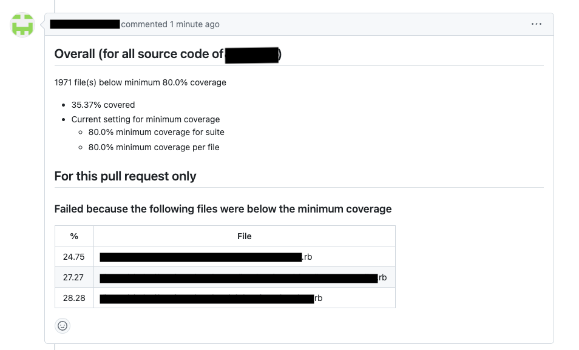

# SimpleCov x Github

A lib which **displays failing test coverage from SimpleCov** while providing the option
to fail a build based on minimum coverage threshold, **as a Github Action or a comment on Github PR.**

- As a Github Action

- As a comment on Github PR


Want to see more examples of this check in action? :wink: See [screenshots.md](/screenshots.md)

## Using as Github Action
### Basic Installation
In order for SimpleCov+ Action to function properly, you first need the simplecov gem. See [Getting Started](https://github.com/simplecov-ruby/simplecov#getting-started).

Assuming you've followed the guide above (you have the gem in your Gemfile and have properly setup test_helper.rb), then the only other step is to utilize the Github action within your workflow.

```yml
  # However you run your tests to generate code coverage
  - name: Run my tests
    run: |
      bundle exec rspec specs/

  # Minimum configuration
  - uses: super-studio/simplecov-github-report@main
    with:
      github_token: ${{ secrets.GITHUB_TOKEN }}
```

### Configuration Options
See [action.yml](./action.yml) for all available options and their defaults.

Most useful is the **minimum_coverage** option as it allows specification as to the value at which a failure result should be produced.

### Advanced Installation
The advanced installation switches the coverage failing mode from **overall test coverage** to **per file coverage**. This is similiar to the `minimum_coverage_by_file` option that SimpleCov provides. See [minimum_coverage_by_file](https://github.com/simplecov-ruby/simplecov#minimum-coverage-by-file)

In order to activate advanced mode, you'll need to configure the simplecov-json gem. See [Usage](https://github.com/vicentllongo/simplecov-json#usage) for simplecov-json.

You'll need to setup both the standard formatter as well as json formatter within your test_helper.rb. Example below:

```ruby
require "simplecov"
require "simplecov-json"
SimpleCov.formatters = SimpleCov::Formatter::MultiFormatter.new([
  SimpleCov::Formatter::HTMLFormatter,
  SimpleCov::Formatter::JSONFormatter
])
SimpleCov.start do
  # your config
end
```

One large benefit to this approach is that your code coverage minimum threshold is less skewed by outlier results. Said best by the SimpleCov documentation:

> You can define the minimum coverage by file percentage expected... This is useful to help ensure coverage is relatively consistent, rather than being skewed by particularly good or bad areas of the code.

### Example configuration

Still struggling to set this up? SimpleCov+ Action utilizes itself within a Github workflow. You can view the workflow and the spec_helper files for a good example of how to configure this check.

[Example Github Workflow](/.github/workflows/testing.yml)

[Example Spec Helper SimpleCov Setup](/specs/spec_helper.rb)

## Using as comment on Github PR
- Create a simple ruby scrip that uses this lib as a gem
  ```ruby
    # file: SimpleCovResultReporter.rb
    require 'simplecov-github-report'

    class SimpleCovResultReporter
        class << self
            def report_github(target_files:)
                ::CheckAction.new.report_to_github_pullrequest(target_files)
            end
        end
    end
    
    target_files = []
    # TODO: change the way to get the changed files list in your pull requests here 
    if File.readable?('./changed-files.txt')
        target_files_str = File.open('./changed-files.txt', &:readline)
        target_files_str.split(' ').each do |file_name|
            # only consider all ruby files as target for code coverage
            target_files << file_name if file_name.end_with?('.rb')
        end
    end
    
    puts "Start report SimpleCov result to Github"
    puts "target_files == #{target_files}"
    SimpleCovResultReporter.report_github(target_files: target_files)
    puts "End report SimpleCov result to Github"
  ```
- Then provide all env as mentioned in [configuration.rb](./lib/coverage/configuration.rb) file, and execute command somewhere in your env (eg: CI)
  ```bash
  ruby SimpleCovResultReporter.rb
  ```

## FAQs

First off there is a `debug` option which prints many of the API calls made to Github. This can be helpful for diagnosing faults in SimpleCov+ Action.

### I don't want to fail coverage on a per-file basis

If you've configured SimpleCov-json then SimpleCov+ Action will automatically
fail CI when any file is below the minimum file coverage. This can be disabled if
you want to utilize SimpleCov-json but don't want SimpleCov+ Action to fail by
setting `minimum_file_coverage` to 0.

### My Code Coverage isn't accurate for Rails parallelize 

Use the following configuration within your test_helper.rb or spec_helper.rb:

```ruby

# inside test_helper.rb or spec_helper.rb
class ActiveSupport::TestCase
  parallelize(workers: :number_of_processors)

  parallelize_setup do |worker|
    SimpleCov.command_name "#{SimpleCov.command_name}-#{worker}"
  end

  parallelize_teardown do
    SimpleCov.result
  end
end
```

Additionally, make sure that your test environment is eager loading your application. This ensures that SimpleCov picks up coverage for all files accurately.

```ruby
# config/environments/test.rb
Rails.application.configure do
  # many more configs...
  
  # Note: ENV["CI"] is set to true by default from Github in the testing environment
  config.eager_load = ENV["CI"].present?
  
  # some more configs...
end
```
