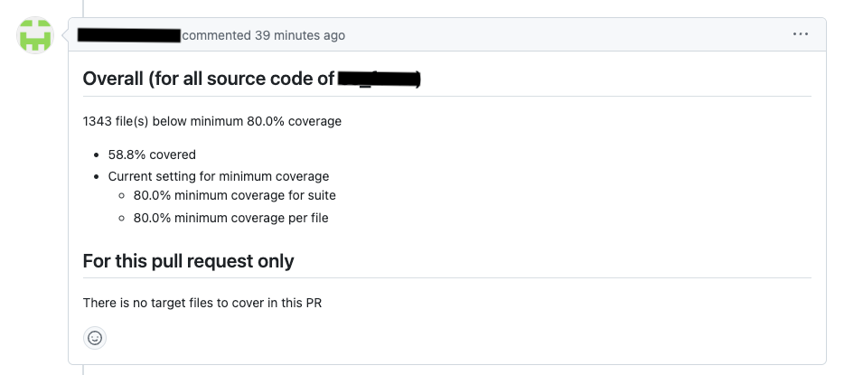
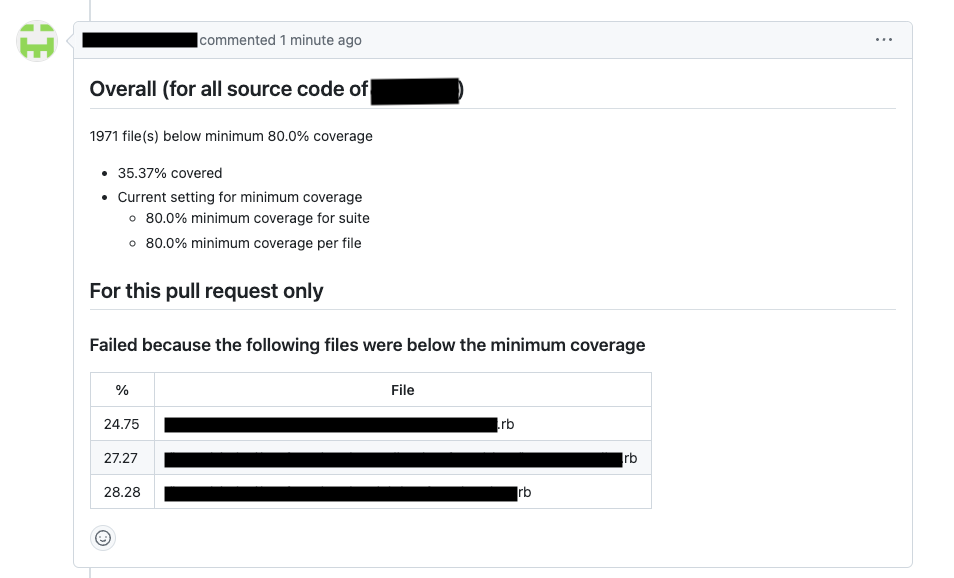

# Screenshots

Below are some basic examples you can exact while using as a Github Action, or as a comment on Github PR

## Github Action
### Basic Output

**Github PR Check UI**
The PR check UI displays the coverage percentage relative to the minimum coverage threshold

**Github Detailed Check UI**
The detailed check UI displays basic coverage statistics

### Advanced Output

**Github PR Check UI**
The PR check UI displays the number of files that were below the minimum coverage threshold

**Github Detailed Check UI**
The detailed check UI displays all files which under the minimum coverage threshold

## Comment on Github PR
**There is no target files to cover in PR**

**There are target files to cover in PR**
